# Polish Card Reservation System - Complete Flow

```mermaid
flowchart TD
    A[🚀 main.py starts] --> B[Load .env variables]
    B --> C[Setup centralized logging]
    C --> D{Check Environment Variables}
    
    D -->|Missing| E[❌ Log error & exit]
    D -->|OK| F[📱 Initialize TelegramBot]
    
    F --> G[🔍 Initialize MonitorController]
    G --> H[📡 Initialize EventQueue]
    H --> I[🧵 Start TelegramBot thread]
    
    I --> J{AUTO_START_MONITOR?}
    J -->|Yes| K[🔄 Auto-start monitor]
    J -->|No| L[⏳ Wait for commands]
    K --> L
    
    L --> M[🎯 Main monitoring loop]
    
    %% TelegramBot Flow
    F --> N[📱 TelegramBot.__init__]
    N --> O[Connect to database]
    N --> P[Setup admin users]
    N --> Q[Register command handlers]
    N --> R[Start event processor thread]
    
    Q --> S["/start Command"]
    Q --> T["/status Command"]
    Q --> U["/pending Command"]
    Q --> V["/stats Command"]
    Q --> W["🔧 Admin Commands"]
    
    W --> X["/start_monitor"]
    W --> Y["/stop_monitor"]
    W --> Z["/restart_monitor"]
    W --> AA["/refresh_db"]
    
    %% Monitor Controller Flow
    G --> BB[MonitorController.__init__]
    BB --> CC[Setup thread locks]
    BB --> DD[Initialize configuration]
    
    X --> EE[MonitorController.start_monitor]
    EE --> FF{Monitor already running?}
    FF -->|Yes| GG[❌ Return false]
    FF -->|No| HH[🎯 Create RealTimeAvailabilityMonitor]
    
    HH --> II[🧵 Start monitor thread]
    II --> JJ[📡 Emit monitor_started event]
    
    %% RealTimeAvailabilityMonitor Flow
    HH --> KK[RealTimeAvailabilityMonitor.__init__]
    KK --> LL[Set page_url & endpoints]
    LL --> MM[Initialize statistics]
    MM --> NN[Setup threading locks]
    
    II --> OO[run_enhanced_monitoring]
    OO --> PP[🗄️ Refresh pending registrants]
    PP --> QQ[📅 Extract datepicker config]
    QQ --> RR[🔍 Start monitoring cycle]
    
    %% Database Operations
    PP --> SS[get_pending_registrations]
    SS --> TT[🗄️ DatabaseManager.get_pending]
    TT --> UU[📊 Query PostgreSQL]
    UU --> VV[Return Registrant objects]
    
    %% Monitoring Cycle
    RR --> WW{Should continue monitoring?}
    WW -->|No| XX[⏹️ Stop monitoring]
    WW -->|Yes| YY[🔄 Check database refresh needed]
    
    YY -->|Yes| PP
    YY -->|No| ZZ[🧵 Parallel date checking]
    
    ZZ --> AAA[ThreadPoolExecutor]
    AAA --> BBB[📅 Check each date via AJAX]
    BBB --> CCC[get_timeslots_for_single_date]
    CCC --> DDD[🌐 POST to godziny_pokoj_A1.php]
    DDD --> EEE[📝 Parse HTML response]
    EEE --> FFF[Return available time slots]
    
    FFF --> GGG{Slots found?}
    GGG -->|No| HHH[📊 Update stats]
    GGG -->|Yes| III[🎯 Attempt auto-registration]
    
    %% Auto-registration Flow
    III --> JJJ[👥 Match registrant to slot]
    JJJ --> KKK{Matching registrant found?}
    KKK -->|No| LLL[⏭️ Skip slot]
    KKK -->|Yes| MMM[📤 Start registration process]
    
    MMM --> NNN[🖼️ Fetch CAPTCHA image]
    NNN --> OOO[🔍 Solve CAPTCHA via API]
    OOO --> PPP[📤 Send registration request]
    PPP --> QQQ[send_registration_request_with_retry]
    
    QQQ --> RRR{Registration successful?}
    RRR -->|No| SSS[❌ Log failure & retry]
    RRR -->|Yes| TTT[✅ Registration success!]
    
    TTT --> UUU[🗄️ Create reservation in DB]
    TTT --> VVV[📡 Emit registration_success event]
    TTT --> WWW[📧 Send Telegram notification]
    
    SSS --> XXX{Max retries reached?}
    XXX -->|No| NNN
    XXX -->|Yes| YYY[❌ Registration failed]
    
    YYY --> ZZZ[📡 Emit registration_failed event]
    
    %% Event Processing
    VVV --> AAAA[EventQueue.put]
    ZZZ --> AAAA
    JJ --> AAAA
    
    AAAA --> BBBB[📡 TelegramBot.event_processor]
    BBBB --> CCCC{Event type?}
    
    CCCC -->|slot_found| DDDD[📅 Format slot message]
    CCCC -->|registration_success| EEEE[✅ Format success message]
    CCCC -->|registration_failed| FFFF[❌ Format error message]
    CCCC -->|monitor_started| GGGG[🚀 Format status message]
    
    DDDD --> HHHH[📱 Send to Telegram users]
    EEEE --> HHHH
    FFFF --> HHHH
    GGGG --> HHHH
    
    %% Continuous Loop
    HHH --> IIII[⏳ Wait check_interval]
    LLL --> IIII
    WWW --> IIII
    YYY --> IIII
    IIII --> WW
    
    %% Cleanup
    XX --> JJJJ[🧹 Cleanup monitoring]
    M --> KKKK{Ctrl+C pressed?}
    KKKK -->|No| M
    KKKK -->|Yes| LLLL[⏹️ Stop monitor]
    LLLL --> MMMM[⏹️ Stop event processor]
    MMMM --> NNNN[✅ Cleanup completed]
    
    %% Styling
    classDef startEnd fill:#e1f5fe
    classDef process fill:#f3e5f5
    classDef decision fill:#fff3e0
    classDef database fill:#e8f5e8
    classDef telegram fill:#e3f2fd
    classDef monitor fill:#fce4ec
    classDef error fill:#ffebee
    
    class A,NNNN startEnd
    class B,C,F,G,H,I,K,L,M process
    class D,J,FF,WW,GGG,KKK,RRR,XXX,CCCC,KKKK decision
    class SS,TT,UU,VV,UUU database
    class N,O,P,Q,R,S,T,U,V,HHHH telegram
    class KK,LL,MM,NN,OO,RR,ZZ,AAA,BBB,CCC monitor
    class E,GG,SSS,YYY,FFFF error
```

## Key Components Explained

### 1. **main.py** - System Orchestrator
- Initializes logging, environment variables
- Creates and coordinates all major components
- Manages application lifecycle

### 2. **TelegramBot** - User Interface
- Handles Telegram commands and user interactions
- Processes events from monitor and sends notifications
- Manages admin permissions and command routing

### 3. **MonitorController** - Monitor Lifecycle Manager
- Thread-safe start/stop control for monitoring
- Manages monitor configuration and status
- Coordinates between Telegram commands and monitor

### 4. **RealTimeAvailabilityMonitor** - Core Monitoring Engine
- Continuously checks appointment availability
- Performs parallel date checking using ThreadPoolExecutor
- Handles auto-registration when slots are found

### 5. **DatabaseManager** - Data Persistence
- Manages PostgreSQL connections and operations
- Stores registrant data and reservations
- Provides pending registrants for monitoring

### 6. **EventQueue** - Inter-Component Communication
- Thread-safe message passing between components
- Enables real-time notifications and status updates
- Decouples monitor from Telegram bot

### 7. **AJAX/CAPTCHA Integration**
- Makes HTTP requests to Polish Card website
- Solves CAPTCHA automatically using external API
- Handles form submission and response parsing

## Data Flow Summary

1. **Startup**: main.py initializes all components and starts threads
2. **Monitoring**: Monitor continuously checks for available appointment slots
3. **Detection**: When slots are found, attempts automatic registration
4. **Registration**: Fetches CAPTCHA, solves it, and submits form
5. **Notification**: Success/failure events are sent via Telegram
6. **Persistence**: Successful registrations are stored in database
7. **Coordination**: All components communicate via event queue system
